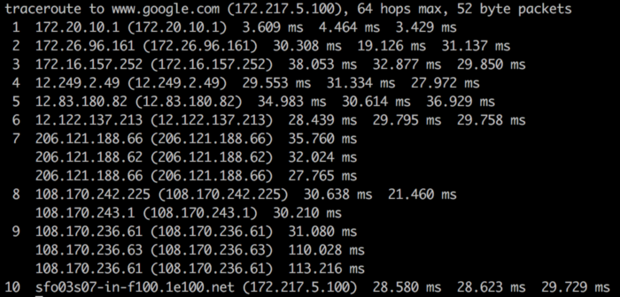
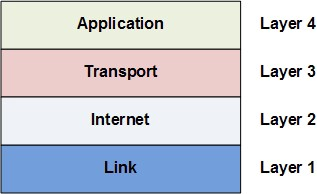
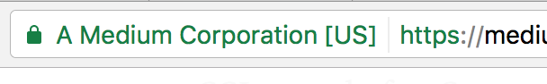

### Internet hoạt động như thế nào?
Internet hoạt động thông qua mạng lưới định tuyến gói tin với Internet Protocol(IP), Transport Control Protocol (TCP) và những  giao thức khác.
### Giao thức là gì 
Giao thức là một tập các luật chỉ ra cách mà những máy tính có thể giao tiếp với nhau thông qua một mạng.
Ví dụ: 
 - Transport Control Protocol có một luật: nếu 1 máy tính gửi dữ liệu đến một máy tính khác, máy đích cần phải cho máy tính nguồn biết nếu có bất kì dữ liệu nào bị thiếu thì máy tính nguồn có thể gửi lại chúng.
 - Internet Protocol chỉ định cách thức những máy tính nên định tuyến thông tin đến những máy tính khác bằng cách đính kèm địa chỉ trên dữ liệu được gửi đi.
### Một packet(gói tin) là gì (What's a packet?)    
Dữ liệu được gửi thông qua Internet được gọi là message(thông điệp). Trước khi message được gửi đi, nó được chia ra thành nhiều phần gọi là những packet. Những packet này được gửi một cách không phụ thuộc với nhau. Thông thưởng kích thước của một packet là 1000 đến 3000 kí tự. Internet Protocol chỉ định làm cách nào để chia message thành những phần nhỏ là packet (packetized).
### Mạng định tuyến gói tin là gì? (What is a packet routing network?)
Nó là một mạng lưới để định tuyến những packet từ một máy nguồn đến một máy đích. Internet được tạo ra bởi một mạng lưới rất lớn nhưng máy tính được gọi là những bộ định tuyến. Nhiệm vụ của mỗi bộ định tuyển là làm cách nào để đưa những packet từ nguồn đến đích. Một packet sẽ di chuyển qua rất nhiều bộ định tuyến xuyên suốt hành trình của nó.
Khi packet di chuyển từ một bộ định tuyển đến bộ định tuyến tiếp theo, nó được gọi là 1 hop. Bạn có thể sử dụng command line-tool traceroute để xem danh sách các hop của những packet ở giữa bạn và host.

Tiện ích Command-line traceroute hiển thị tất cả các hop nữa máy tính của tôi và server của google.
Internet Protocol chỉ định cách địa chỉ mạng được đính kèm vào header của packet. Một vùng nhớ được chỉ định của packet chứa meta-data của nó. Internet Protocol đồng thời chỉ định cách mà những bộ định tuyến chuyển tiếp những packet dựa trên địa chỉ trong header.

### Những bộ định tuyến Internet có từ đâu? Ai là người sở hữu chúng?

Những bộ định tuyến có nguồn gốc từ những năm 1960 với tên là ARPANET, một dự án quân đội với mục tiêu là một mạng máy tính được phân cấp để chính phủ có thể truy cập và phân tán thông tin trong trường hợp xảy ra sự kiện thảm khốc. Kể từ đó, rất nhiều tập đoàn cung cấp dịch vụ Internet (Internet Service Provider - ISP) đã thêm những bộ định tuyến vào trong mạng lưới những bộ định tuyến ARPANET.
Vì vậy không có một đơn vị độc lập nào là chủ sở hữu của những bộ định tuyến Internet. Nhưng có rất nhiều chủ sở hữu: những cơ quan chính phủ và nhưng trường đại học đã liên kết với ARPANET từ những ngày đầu và tập đoàn ISP như là AT&T và Verzion sau này.
Câu hỏi ai là chủ sở hữu Internet giống như câu hỏi ai là chủ sở hữu của toàn bộ đường dây điện thoại. Không một thực thể nào sở hữu tất cả. Rất nhiều thực thể khác nhau sở hữu một phần của nó.

### Có phải tất cả những packet đều được gửi đến theo đúng thứ tự? Nếu không làm cách nào để những message được lắp ráp lại?

Những packet có thể gửi đến đích không đúng theo thứ tự. Điều này xảy ra khi một packet sau tìm thấy con đường ngắn hơn để đến đích so với packet trước đó. Nhưng trong header của packet chứa toàn bộ thông tin về thứ tự liên quan đến toàn bộ message của những packet. Transport Control Protocol sử dụng nhưng thông tin này để khởi tạo lại message tại điểm đích.

### Có phải những packet luôn luôn đến được đích?

Internet Protocol không đảm bảo cho tất cả các packet đều sẽ được nhận tại đúng đích đến của nó. Khi điều này xảy ra, nó được gọi là packet loss. Điều này thường xảy ra khi bộ định tuyến(router) nhận được nhiều packet hơn khả năng xử lý của nó. Khi này router không có sự lựa chọn nào khác ngoài việc bỏ qua một vài packet. 
Tuy nhiên, Transport Control Protocol xử lý những packet loss bằng performing re-transmission(Thực hiện gửi lại). Điều này có thể thực hiện bởi vì nó yêu cầu máy đích định kì gửi thông tin về những packet đã nhận đến máy tính nguồn điều này giúp cho máy nguồn biết được có bao nhiêu message máy đích đã nhận và đã khởi tạo lại thành công. Nếu máy đích tìm kiếm những packet còn thiếu, nó sẽ gửi một yêu cầu đến máy nguồn để máy nguồn có thể gửi lại những packet còn thiếu.
Khi 2 máy giao tiếp với nhau thông qua Transport Control Protocol, chúng ta gọi nó là một kết nối TCP giữa chúng.

### Những địa chỉ Internet trông như thế nào?

Những địa chỉ Internet được gọi là địa chỉ IP và chúng có 2 chuẩn.
Chuản địa chỉ đầu tiên được gọi là IPv4 và nó trông như sau 212.69.69.69 . Nhưng bởi vì IPv4 chỉ có thể hỗ trợ 2³² (khoảng 4 tỷ) địa chỉ. Internet Task Force (Lực lượng đặc nhiệm Internet😳😐) một chuẩn mới được gọi là IPv6, IPv6 trông như sau 3ffe:1869:3469:4:369:f369:f369:69fc . IPv6 có thể hỗ trợ 2¹²⁸ địa chỉ, cho phép nhiều thiết bị hơn truy cập thiết bị. Con số này sẽ nhiều hơn 8+ tỷ thiết bị được kết nối mạng trên Internet tính đến năm 2017.
Như vậy, có một ánh xạ 1-1 gữa địa chỉ IPv4 và IPv6. Chú ý rằng việc chuyển từ IPv4 sang IPv6 vẫn đang được thực hiện và sẽ mất nhiều thời gian. Kể từ năm 2014, Google công bố rằng chỉ có 3% lượng lượt truy cập sử dụng IPv6.

### Làm thế nào nếu có 8 tỷ thiết bị kết nối Internet nếu trong khi chỉ có 4 tỷ địa chỉ?

Nó bởi vì chúng có cả private IP và public IP. Rất nhiều thiết bị trên một khu vực mạng kết nối với Internet sẽ chia sẻ chung một địa chỉ IP public. Trong khi ở mạng nội bộ, những thiết bị này đều có những private IP riêng biệt. thông thường sẽ là 19.168.x.x hoặc 172.16.x.x hoặc 10.x.x.x trong đó x là số nằm giữa 1 và 255. Những private IP (Địa chỉ nội bộ) này được chỉ định bởi Dynamic Host Configuration Protocol (DHCP).
Ví dụ:
- Nếu một laptop và 1 smartphone trên một mạng nội, khi cả 2 đều gửi yêu cầu(request) đến www.google.com, trước khi những packet rời khởi modem( Modulator and Demodulator - bộ điều giải - bộ điều chế và giải điều chế các tín hiệu số thành tín hiệu tương tự và ngược lại). Nó sẽ sửa đổi lại packet headers và chỉ định một trong những cổng của nó cho packet. Khi máy chủ gooogle gửi trả những phản hồi(respond) cho những request, nó sẽ gửi dữ liệu quay lại cổng đã được chỉ định, khi đó modem sẽ biết những packet sẽ được gửi đến cho laptop hay smartphone. 
Trong trường hợp này, địa chỉ IP không định nghĩa cho một máy, mà là một kết nối đến Internet. Địa chỉ là duy nhất trên máy tính của bạn là địa chỉ MAC, thứ mà sẽ không bao giờ thay đổi trong suốt vòng đời có máy tính. Giao thức ánh xạ từ địa chỉ private IP sang địa chỉ public IP được gọi là giao thứcNetwork Addess Translation (NAT). Nó có thể hỗ trợ 8+ tỷ thiết bị kết nối chỉ với 4 tỷ địa chỉ IPv4 khả dụng.

### Làm thế nào để router biết được một packet sẽ được gửi đi đâu? Có phải nó cần phải biết tất cả địa chỉ IP trên Internet hay không?

Mọi router đều không cần phải bết tất cả địa chỉ IP trên Internet. Nó chỉ cần biết về một trong những cái khác xung quanh nó, được gọi là một outbound link, để định tuyến từng packet đến. Chú ý rằng địa chỉ IP có thể được chia thành 2 phần là tiền tố mạng(network prefix) và định danh máy chủ(host identifier).
Ví dụ: 129.42.13.69 có thể chia thành:
- Network prefix: 129.42
- Host identifier: 13.69
Tất cả thiết bị kết nối mạng kết nối với Internet thông qua một kết nối duy nhất (Khuôn viên trường đại học, một doanh nghiệp, hoặc một đơn vị cung cấp dịch vụ Internet trong khu vực tàu địa ngầm) sẽ chia sẻ cùng network prefix tương tự nhau.
Những bộ định tuyến sẽ gửi tất cả packet từ 129.42.*.* đến cùng một vị trí. Vì vậy thay vì phải theo dõi hàng tỷ địa chỉ IP, những bộ định tuyến chỉ cần theo dõi ít hơn một tỉ network prefix.
Nhưng router vẫn phải biết rất nhiều network prefix. Nếu router mới được thêm vào Internet làm cách nào để nó biết cách để xử lý những packet cho tất cả những network prefix? 
Một router có để được thêm vào với một vài router được cấu hình trước. Nhưng nếu nó gặp phải một packet mà nó không biết làm cách nào để định tuyến, nó sẽ truy vấn đến một trong những router lân cận. Nếu router lân cận biết cách để định tuyến packet, nó sẽ gửi thông tin đó đến router yêu cầu. Router yêu cầu sẽ lưu trữ lại thông tin này để sử dụng cho tương lai. Bằng cách này, một router mới tự xây dựng bảng định tuyến riêng của nó, một cơ sở dữ liệu của những network prefix đến những outbound link. Nếu router lân cận không biết, nó sẽ tiếp tục truy vấn đến router lân cận của nó.

### Làm cách nào để những máy tính kết nối mạng tìm ra địa chỉ IP dựa trên tên miền?

Chúng ta gọi việc tìm kiếm địa chỉ IP dựa trên một tên miền có thể đọc được như là www.google.com là "resolving the IP address". Máy tính lấy được địa chỉ IP thông qua Domain Name System(DNS), một cơ sở dữ liệu phân quyền của ánh xạ giữa tên miền và địa chỉ IP. Để xử lý một địa chỉ IP, đầu tiên máy tính kiểm tra nó trong DNS được lưu ở bộ nhớ đệm tại local. Nơi lưu trữ địa chỉ IP của những trang web đã được truy cập gần đây. Nếu không thể tìm thấy địa chỉ IP tại đây hoặc bản ghi địa chỉ IP đã hết hạn, nó sẽ truy vấn đến máy chủ DNS của nhà cung cấp dịch vụ Internet (Internet Serivce Provider - ISP) nơi được giành riêng để xử lý những địa chỉ IP. Nêu máy chủ DNS của ISP không thể xử lý địa chỉ IP, nó sẽ truy vấn đến máy chủ định danh gốc, nơi có thể xử lý mọi tên miền cho một tên miền cấp cao nhất (top-level domain)(which can resolve every domain name for a given top-level domain). Top-level domain là những từ ở bên phải dấu chấm ngoài cùng bên phải tên miền. Ví dụ: .com, .vn, .org . 

### Làm cách nào để các ứng dụng có thể giao tiếp thông qua Internet?

Giống như nhiều dự án kỹ thuật phức tạp khác, Internet được chia nhỏ thành những thành phần nhỏ hơn không phụ thuộc vào nhau, những phần này làm việc cùng nhau qua một giao diện(interface) được xác định rõ. Những thành phần này được gọi là Internet Network Layers và chúng bao gồm: Link Layer (lớp liên kết), Internet Layer, Transport Layer (lớp vận chuyển), và Application Layer (lớp ứng dụng.). Chúng được gọ là những lớp(layer) với vì chúng được xây dựng chồng lên nhau. Từng lớp này sử dụng khả năng của những lớp bên dưới nó mà không bận tâm đến việc nó được triển khai chi tiết như thế nào.

Những ứng dụng internet làm việc tại Application Layer và không cần quan tâm về chi tiết của những tầng bên dưới như thến nào. Ví dụ, những kết nối của một ứng dụng đến ứng dụng khác trên mạng thông qua TCP sử dụng một kiến trúc gọi là socket, thứ sẽ tóm gọn lại những chi tiết phức tạp của những routing packet(gói định tuyến) và tập hợp các packet lại thành những message.

## Công việc của những lớp trên là gì?

Ở lớp thấp nhất là Link Layer, lớp này là "Physical layer"(lớp vật lý) của internet. Link Layer liên quan đến việc truyền tải các bit dữ liệu qua một số phương tiện vật lý thông thường như cáp quang hoặc là tín hiệu vô tuyến wifi. 
Bên trên của Link Layer là Internet Layer. Internet Layer liên quan đến việc định tuyến những packet đến được với đích của nó. Internet Protocol được đề cập bên trên nằm trong lớp này (Do đó có cùng tên). Internet Protocol tự động điều chỉnh và định tuyến lại các packet dựa trên tải hoặc ngắt mạng. Lưu ý rằng nó không đảm bảo rằng tất cả các packet luôn luôn được đưa đến đích, nó chỉ cố gắng làm tốt nhất có thể.
Bên trên của Internet Layer là Transport Layer. LỚp này là để bù đắp cho thực tế rằng dữ liệu có thể bị mất trên Internet và trên Link Layer bên dưới. Transport Control Protocol được nhắc đến ở trên nằm trên lớp này, và công việc chủ yếu của nó là lắp ráp lại những packet thành những message nguyên bản và gửi lại những packet bị mất.
Application Layer ở bên trên cùng. Lớp này sữ dụng tất cả những lớp bên dưới để xử lý những chi tiết phức tạp của việc di chuyển các packet trên Internet. Nó cho phép các ứng dụng có thể dễ dàng tạo ra được kết nối với csac ứng dụng khác trên Internet với những abstraction đơn giản như socket. Giao thức HTTP (Hypertext Transfer Protocol) chỉ định cách các trình duyệt web và các web server sẽ tương tác trong Application Layer. Giao thức IMAP (Internet message access protocol) chỉ định bằng cách nào các ứng dụng email có thể truy suất email tồn tại trong Application Layer. Giao thức FTP(File Transfer Protocol) chỉ định giao thức truyền tải tập tin giữa máy khách tải tệp tin và máy chủ lưu trữ tệp tin tồn tại trong Application Layer.

## Máy khách so với máy chủ là gì (What's a client versus a server) ?

Mặc dù máy khách và máy chủ đều là những ứng dụng giao tiếp thông qua Internet, tuy nhiên máy khách thì "gần người dùng hơn(closer to the user)" là những ứng dụng hướng tới người dùng nhiều hơn như là trình duyệt web, ứng dụng email, hoặc ứng dụng di động. Máy chủ là những ứng dụng chạy trên những máy tính điều khiển từ xa mà máy khách sẽ giao tiếp thông qua Internet khi cần. 
Định nghĩa chính thức hơn thì ứng dụng khởi tạo một kết nối TCP là máy khách. Ứng dụng nhận kết nối TCP là máy chủ. 

## Làm cách nào những thông tin nhạy cảm như thông tin thẻ tín dụng được bảo mật khi được truyển tải qua Internet?

Trong những ngày đầu của Internet, nó đã đủ để đảm bảo rằng các bộ định tuyến mạng và liên kết mạng ở các vị trí an toàn về mặt vật lý. Nhưng khi Internet phát triển, càng nhiều router tức là càng nhiều điểm dễ bị khai thác hơn. Hơn nữa, với sự ra đời của công nghệ không dây như WiFi, hacker có có thể chặn các gói tin trên đường đi của chúng, nó khiến cho việc đảm bảo an toàn ở những thiết bị phần cứng vật lý là không đủ. Giải pháp là mã hóa và xác thực thông qua SSL/TLS

## SSL/TLS là gì?

SSL là viết tắt của Secured Sockets Layer. TLS là viết tắt của Transport Layer Security. SSL ban đầu được phát triển bởi Netscape vào năm 1994 nhưng sau đấy phiên bản bảo mật hơn được đưa ra và được đổi tên thành TLS. Chúng tôi sẽ giới thiệu chúng cùng nhau là SSL/TLS. 
SSL/TLS là một lớp được lựa chọn nằm ở giữa Transport Layer và Application Layer. Nó cho phép bảo mật những thông tin nhạy cảm được giao tiếp qua Internet bằng cách mã hóa và xác thực. 
Mã hóa có nghĩa là máy khách có thể yêu cầu mã hóa kết nối TCP đến máy chủ. Có nghĩa là tất cả message được gửi giữa máy khách và máy chủ sẽ được mã hóa trước khi chia nhỏ thành những packet. Nếu hacker bắt được những packet này, họ sẽ không thể khởi tạo lại thành những message ban đầu. Xác thực nghĩa là máy khách có thể tin tưởng rằng máy chủ chính nguồn mà nó tuyên bố. Điều này giúp chống lại các cuộc tấn công man-in-the-middle, man-in-the-middle là khi một bên độc hại ngăn chặn kết nối ở giữa máy khách và máy chủ để nghe trộm và giả mạo thông tin liên lạc giữa họ. 
Chúng ta có thể thấy SSL khi chúng ta truy cập những trang web đã được kích hoạt SSL trên những trình duyệt hiện đại. Khi một trình duyệt request một trang web sử dụng giao thức https thay cho giao thức http, nó nói với máy chủ rằng nó muốn một kết nối mã hóa SSL. Nếu máy chủ web hỗ trợ SSL, một kết nối mã hóa được tạo ra và chúng ta sẽ nhìn thấy một icon gần thanh địa chỉ web trên trình duyệt.

medium.com là một máy chủ web đã kích hoạt SSL. Trình duyệt có thể kết nối đến nó thông qua https để chắc chắn rằng thông tin giao tiếp đã được mã hóa. Trình duyệt cũng chắc chắn rằng nó đang giao tiếp với máy chủ medium.com thực sự, và không có một cuộc tấn công man-in-the-middle nào.

## Làm cách nào để SSL xác thực định danh của một máy chủ và mã hóa thông tin liên lạc của họ?

Nó sử dụng mã hóa bất đối xứng và xác thực SSL. 
Mã hóa bất đối xứng là một thuật toán mã hóa sử dụng một public key và một private key. Về cơ bản những key này chỉ là một chuối số bắt nguồn từ những số nguyên tố lớn. Private key thì được sử dụng để giải mã dữ liệu và chữ kí của tài liệu. Public key được sử dụng để mã hóa dữ liệu và xác thực chữ ký tài liệu. Khác với mã hóa đối xứng, mã hóa bất đối xứng có khả năng mã hóa nhưng không không tự động có khả năng giải mã. Nó thực hiện điều này bởi sử dụng nguyên lý của một nhánh toán học được gọi là lý thuyết số(number theory). 
Một chứng chỉ SSL là một tài liệu kỹ thuật số nó bao gồm một public key được gán cho một web server. Chứng chỉ SSL được cấp cho server bởi cơ quan cấp chứng chỉ. Hệ điều hành, thiết bị di động, và trình duyệt đi kèm một cơ sơ dữ liệu của một số cơ quan cấp chứng chỉ để nó có thể xác thực được chứng chỉ SSL. 
Khi một máy khách(client) yêu cầu một kết nối đã được mã hóa SSL đến một server, server gửi lại nó một chứng chỉ SSL. Client kiểm tra chứng chỉ SSL: 
- Có phải đã được cấp cho server này hay không.
- Có phải là đã được ký bởi cơ quan cấp chứng chỉ đáng tin cậy.
- Có phải nó vẫn chưa bị hết hạn?
Client sử dụng public key của SSL certificate để mã hõa một khóa bí mật tạm thời được sinh ra ngẫu nhiên và gửi chúng đến server. Bởi vì server có một private key trương ứng, nên nó có thể giải mã khóa bí mật của client. Khi này cả client và server đều có mã bí mật tạm thời, vì vậy chúng đều có thể sử dụng nó để mã hóa đối từng message chúng gửi cho nhau sau đó. Chúng sẽ xóa bỏ khóa bí mật tạm thời này sau khi phiên làm việc hết hạn.

## Điều gì sẽ xảy ra khi tin tặc(hacker) chặn được một phiên làm việc đã được mã hóa SSL?

Giả sử hacker chặn được tất cả mọi message được gửi giữa client và server. Hacker thấy được chứng chỉ SSL mà server gửi, cũng như là khóa bí mật đã được mã hóa của client. Nhưng bởi vì hacker không có private key, nó không thể giải mã bất kì một tin nhắn nào giữa client và server. 

## Tóm tắt
Internet được khởi đầu với cái tên ARPNET từ những năm 1960 với mục tiêu là một mạng lưới máy tính phi tập chung. Về mặt vật lý, Internet là một tập hợp những máy tính di chuyển từng bit dữ liệu cho nhau thông qua dây dẫn, dây cáp, và tín hiệu vô tuyến. 
Giống với nhiều dự án kỹ thuật phức tạp khác, Internet chia nhỏ thành những lớp khác nhau, từng phần này chỉ xử lý những nhiệm vụ nhỏ hơn. Những lớp này giao tiếp với nhau thông qua những giao diện đã được xác định rõ ràng(well-defined interfaces).
Có nhiều giao thức xác định nên cách thức làm việc của Internet và những ứng dụng của nó sẽ hoạt động ở các lớp khác nhau: HTTP, IMAP, SSH, TCP, UDP, IP, ... Theo nghĩa này, Internet là một tập hợp những nguyên tắc cho các máy tính và chương trình sẽ hoạt động như là một mạng máy tính vật lý.
Với sự phát triển của Internet, sự ra đời của WIFI, và như cầu thương mại điện tử, SSL/TLS đã được phát triển để giải quyết các lo ngại về bảo mật.

# Nguồn 
[source link](https://medium.com/@User3141592/how-does-the-internet-work-edc2e22e7eb8)